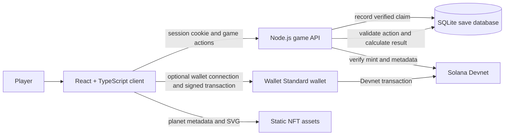

# FeNi — Cosmic Miner

**A browser based space mining and planet collection game with optional Solana Devnet collectibles.** Mine asteroids, collect resources, open planet cases, upgrade your equipment, and explore new sectors.

> FeNi is an MVP prototype. Core gameplay and saves run through the game server; wallet connection is optional.

## What you can do

- Mine asteroids with different durability and resource drops.
- Spend resources on cases to discover planets from a 31-world catalog.
- Equip planets for small gameplay bonuses and unlock new sectors.
- Craft alloys, scanners, drills, and other workshop upgrades.
- Optionally connect a Solana wallet and mint a discovered planet as an NFT on Devnet.

## Solana integration

The game uses Wallet Standard to connect compatible wallets such as Phantom and Solflare to **Solana Devnet**. A wallet is not required to play: guest progress is stored by the game server and is independent of wallet ownership. Signing a message links a wallet to the current save; it does not transfer funds.

The optional planet NFT flow uses standard Metaplex Token Metadata accounts. The player reviews and signs the mint transaction in their wallet. The server verifies the resulting transaction and on-chain metadata before recording the claim. Planet metadata and SVG art are generated into `public/nft/planets` and served by the game site.

Mining, resource balances, cases, upgrades, and saves remain **off-chain**. The project currently has no fungible game token, paid advantage, or mainnet transaction. NFT metadata is hosted by the game site; use durable decentralized storage such as IPFS or Arweave before promising permanent availability.

## Architecture



The API owns saved balances and calculates mining rewards, case outcomes, crafting costs, and upgrades. Guest saves use a random server account ID in SQLite and an `HttpOnly` cookie. Wallet linking is optional and is only needed for wallet based features such as planet NFT claims. See [the architecture notes](docs/ARCHITECTURE.md) for the data flow, security boundaries, and current limitations.

## Run locally

Requirements: **Node.js 22.13 or newer**. The API uses Node's built-in SQLite module.

```bash
npm install
npm run dev
```

Open the Vite URL printed in the terminal, usually `http://localhost:5173`. The game starts in guest mode; no wallet is needed. On first run, the dev server creates `data/.game-auth-secret` and the SQLite database under `data/`. Keep both between restarts to retain the same local save. These files are ignored by Git.

To build for deployment:

```bash
npm run build
npm start
```

The production Node process serves both the built site and `/api`. Configure these server-side variables:

| Variable | Purpose |
| --- | --- |
| `GAME_AUTH_SECRET` | Persistent random secret, at least 32 characters, used to sign guest-session cookies. |
| `GAME_SITE_ORIGIN` | Exact public HTTPS origin serving the site and API. |
| `GAME_DATA_DIR` | Persistent writable directory for SQLite; defaults to `./data`. |
| `GAME_BACKUP_DIR` | Optional separate persistent directory for database backups. |
| `GAME_SOLANA_RPC_URL` | Optional server-side Solana RPC URL; defaults to Devnet. |
| `PORT` | Optional hosting port; defaults to `8787`. |

For NFT metadata, set `VITE_PUBLIC_URL` to the public site origin **before building**. Production needs a trusted HTTPS reverse proxy, a persistent data volume, and one API instance. SQLite is not configured for multi-instance deployment. Never place `GAME_AUTH_SECRET` in a `VITE_` variable or commit a real `.env` file. See [.env.example](.env.example) and the deployment details above.

## Project layout

```text
src/                  React interface, game rules, and Solana client
server/               Authoritative Node API and NFT verification
public/nft/planets/    Generated planet metadata and SVG artwork
scripts/               Dev runner, metadata generation, and integration check
docs/                 Architecture, roadmap, and integration notes
```

Useful project documents:

- [Architecture and security boundaries](docs/ARCHITECTURE.md)
- [Roadmap](docs/ROADMAP.md)
- [iDos publishing and integration notes](docs/IDOS-INTEGRATION.md)
- [Solana achievement proof design](docs/ACHIEVEMENTS-SOLANA.md)

## Current limitations

- Planet NFTs and wallet flows are configured for Devnet; there is no mainnet deployment.
- The API uses SQLite and expects a single server instance with persistent storage.
- The game site currently hosts NFT metadata and artwork itself.
- Achievement progress is a local prototype and is not an on-chain proof.
- Server-side checks protect saved state from direct client edits, but they do not make automated play impossible. Mining clicks have no per-click cooldown; the API still has request rate limits and guards for selected actions.

See the [roadmap](docs/ROADMAP.md) for proposed next steps. These items are plans, not shipped features.
